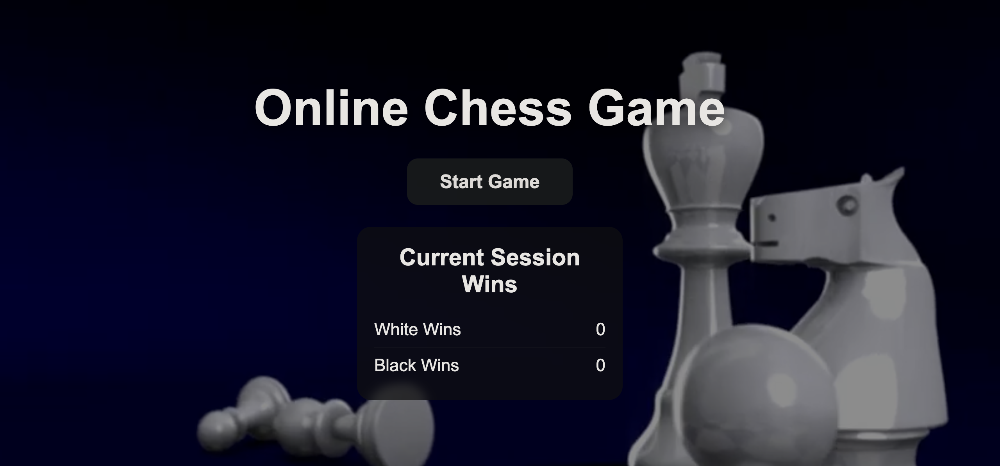
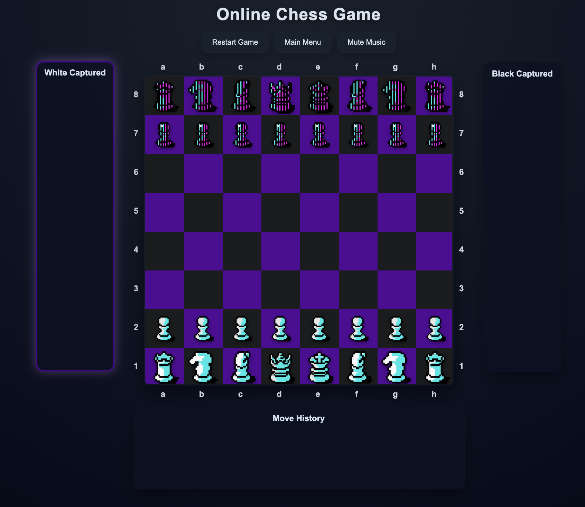
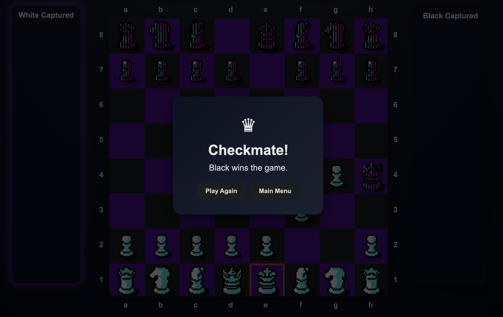

# Online chess game

## Description
This project is a browser-based online chess game developed using **HTML, CSS, and JavaScript**. The objective is to create an interactive 2-player chess application that runs entirely on the client side, without requiring any backend server or database.

The chess board is generated dynamically with JavaScript, and the full game logic is implemented in the browser. This includes legal move validation for all pieces, turn switching, check and checkmate detection, illegal move prevention, captured pieces tracking, move history recording, restart functionality, and drag-and-drop support.

The project follows an object-oriented design, with separate classes for the chess pieces and the main game controller, in order to keep the code modular, organized, and easier to maintain. In addition, the interface includes visual improvements such as highlighted legal moves, animated interactions, modal dialogs, and sound effects to provide a more complete and user-friendly gameplay experience.

## Getting Started
1. Clone this repository or download the project files.
2. Open the project folder in **VS Code** or another code editor.
3. Run the project locally in a browser.
   - You can open `main.html` directly, or
   - use a local server such as:
     ```bash
     python -m http.server 8000
     ```
4. If using a local server, open:
   ```text
   http://localhost:8000/html/main.html
   ```
5. From the main menu, press Start Game to load the chess board and begin playing.

A quick checkmate technique for a fast win is the following:

1. **White:** `f2 -> f3`
2. **Black:** `e7 -> e5`
3. **White:** `g2 -> g4`
4. **Black:** `Qd8 -> h4`

This sequence results in a quick checkmate against White.

## User Interface Overview

The application is divided into two main screens: the **main screen** and the **game screen**.

### Main Screen



The main screen is the starting menu of the application. It contains the game title, a **Start Game** button, and a session score panel. The Start Game button is used to enter the chess board and begin a new match. The session score panel displays the number of wins achieved by the white and black player during the current session. A background video is also included to improve the visual presentation of the menu.

### Game Screen



The game screen is the main area where the match takes place. At the center of the screen there is the **chess board**, which displays all pieces and allows the player to interact with them either by clicking or by using drag and drop. Around the board there are coordinate labels with letters and numbers, so that positions can be recognized more easily using standard chess notation.

On the left side there is the **White Captured panel**, which shows the white pieces that have been captured during the game. On the right side there is the **Black Captured panel**, which shows the black pieces that have been captured. These panels also help indicate whose turn it is, since the active side is visually highlighted.

Below the board there is the **Move History panel**, which records the moves made during the match in chronological order. This allows the player to follow the progression of the game more clearly.

At the top of the game screen there is a **control button area**. It includes the Restart Game button, which resets the current match, the Main Menu button, which returns the user to the starting screen, and the Mute Music button, which controls the background audio.

In addition, the game screen includes visual feedback features such as highlighted legal moves, check indication, move and capture animations, and a victory modal that appears when the game ends in checkmate.

